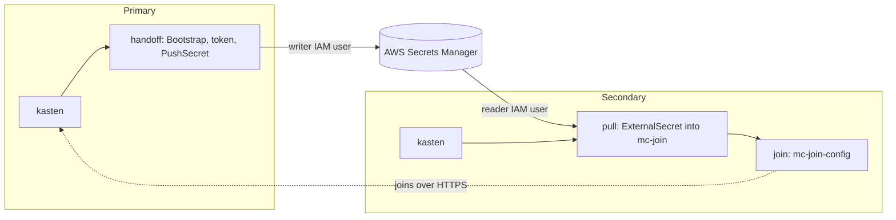

# Kasten multi-cluster with Flux, OpenShift and AWS Secrets Manager

This folder installs Veeam Kasten on two OpenShift clusters with Flux. One
cluster becomes the multi-cluster **primary**. The other joins as a
**secondary**. The join token moves through AWS Secrets Manager.

> Work in progress.



## Files

```text
bootstrap/<cluster>/     FluxInstance example: points Flux at clusters/<cluster>
clusters/ocp-primary/    Flux stages for the primary: kasten, handoff
clusters/ocp-secondary/  Flux stages for the secondary: kasten, pull, join
values/                  Values for each cluster, OpenShift and AWS
charts/kasten-mc/        The chart (Kasten is a subchart). Works with any GitOps engine.
charts/eso-provider-aws/ The ESO ClusterSecretStore for AWS Secrets Manager
docs/                    Architecture, runbook, AWS setup, provider contract, ROSA
check.sh                 Offline check of the chart and the stages
```

## Before you start

- Flux Operator, and the `FluxInstance` from `bootstrap/<cluster>/`.
- External Secrets Operator 2.12 on both clusters.
- The AWS resources in [docs/aws.md](docs/aws.md).
- The secondary can reach the primary's Kasten Route over HTTPS.
- If an ingress certificate is private or self-signed: the CA bundle step in
  the [runbook](docs/runbook.md).
- If the secondary already runs Kasten: see "Secondary that already runs
  Kasten" in the [runbook](docs/runbook.md). You do not reinstall it.

Git holds no hostnames. The chart reads each dashboard URL from the Kasten
Route at install time.

To check your changes offline, run `flux/MCM/check.sh`.

More: [architecture](docs/architecture.md), [runbook](docs/runbook.md),
[AWS setup](docs/aws.md), [provider contract](docs/provider-contract.md),
[ROSA](docs/rosa.md).
