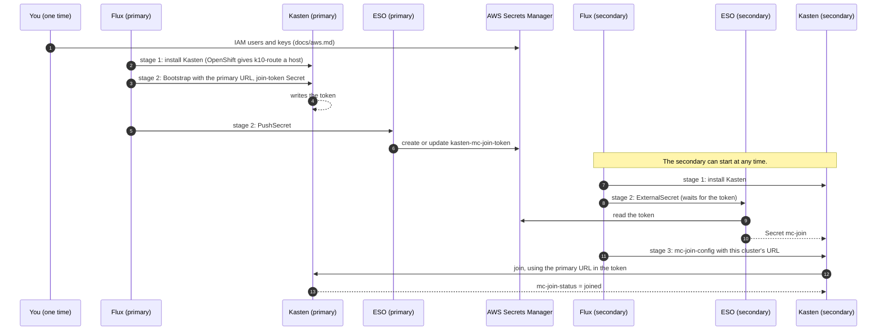

# Architecture

This setup installs Veeam Kasten on two OpenShift clusters with Flux. One
cluster is the multi-cluster **primary**. The other joins it as a
**secondary**. A join token moves from the primary to the secondary through
AWS Secrets Manager. The clusters share nothing else.

## Stages

Each stage is one Helm release of `charts/kasten-mc`. Each release turns on
different parts of the chart.

| Cluster | Stage | Flux object | Parts on | Ready when |
|---|---|---|---|---|
| Primary | 1 kasten | HelmRelease `kasten-mc-kasten` | Kasten | Kasten pods are ready |
| Primary | 2 handoff | HelmRelease `kasten-mc-handoff` (`dependsOn` stage 1) | Bootstrap, join token, writer store, PushSecret | The PushSecret is Ready |
| Secondary | 1 kasten | HelmRelease `kasten-mc-kasten` | Kasten | Kasten pods are ready |
| Secondary | 2 pull | Kustomization `kasten-mc-pull` → HelmRelease `kasten-mc-pull` | Reader store, ExternalSecret | The ExternalSecret is Ready |
| Secondary | 3 join | Kustomization `kasten-mc-join` (`dependsOn` stage 2) | `mc-join-config` | The ConfigMap exists |

The secondary uses Kustomizations for stages 2 and 3, because only a
Kustomization can wait for the ExternalSecret. Stage 2 stays Ready=False
until the primary pushes a token. Flux checks again every 2 minutes. This is
the only wait between the clusters.

## Sequence

## Dashboard URLs

Kasten needs two URLs: the primary's URL (in the Bootstrap) and the
secondary's URL (`cluster-ingress` in `mc-join-config`). The chart finds
each URL in this order:

1. The full URL you set (`handoff.bootstrap.ingressURL` or
   `handoff.join.clusterIngress`).
2. The k10 Route values, if `k10.route.enabled` and `k10.route.host` are
   set.
3. The k10 Ingress values, if `k10.ingress.create` and `k10.ingress.host`
   are set. Use this on AKS, EKS and other clusters with an Ingress
   controller.
4. The host that OpenShift gave the `k10-route` Route. The chart reads it
   with Helm `lookup`. This works in Flux and `helm install`. It does not
   work in `helm template` or Argo CD.

In steps 2 to 4, the path follows the k10 chart: `route.path` or
`ingress.urlPath`, or `k10`. The scheme is `https` when TLS is on, and
`http` when it is off. If nothing matches, the install stops with a clear
error. Set the explicit URL for a LoadBalancer service (`externalGateway`)
or an Ingress with no host.

Give every stage the same `k10` values. The handoff stages do not install
Kasten, but they read its Route and Ingress values. Stage 2 and stage 3
start after stage 1, so the Route exists when the chart reads it. This
keeps hostnames out of Git.

## Other platforms

The chart has no OpenShift parts. [`../values/openshift.yaml`](../values/openshift.yaml)
turns on the k10 SCC and Route. On AKS, EKS or another cluster, use a
values file that sets `k10.ingress.*` instead.

`eso-provider-aws` signs in with access keys. On EKS, you can use Pod
Identity or IRSA instead, with a setup similar to [rosa.md](rosa.md).

## Why a Bootstrap resource for the primary

The Kasten Helm values `multicluster.primary.*` need the URL at install time,
and a chart cannot compute a subchart value. The Kasten `Bootstrap` resource
(Kasten docs, Multi-Cluster Getting Started, kubectl method) takes the URL
from our chart instead.

## What is manual, declarative and imperative

| Kind | Items |
|---|---|
| Manual, one time | Flux Operator and `FluxInstance`, ESO, the AWS resources ([aws.md](aws.md)) |
| Declarative (Flux keeps it in sync) | Kasten, the primary setup, the join token, push, pull, join, token rotation and revocation |
| Imperative | Disconnect a secondary (delete its `Cluster` on the primary), AWS teardown |

## Token lifecycle

- **Rotate:** increase `handoff.token.generation` in
  `flux/MCM/clusters/ocp-primary/handoff.yaml`. Helm creates a new token
  Secret and deletes the old one. Kasten revokes the old token. The
  PushSecret sends the new token to the same AWS secret.
- **Revoke:** set `handoff.token.enabled` and `handoff.push.enabled` to
  `false`.
- **Joined secondaries:** a secondary uses the join token only to join. When
  it gets a new token, Kasten joins again under the same cluster ID. A
  secondary that misses a rotation stays connected.

## Decisions

| Topic | Choice |
|---|---|
| Clusters | On-prem OpenShift. ROSA is documented only ([rosa.md](rosa.md)). |
| Versions | Kasten 9.0.7, ESO 2.12.0, Flux 2.9 with the Flux Operator |
| Packaging | One chart. Kasten is a subchart. Every part has an on/off value. |
| Flux lockdown | Off (`cluster.multitenant: false`). All Flux objects are in `flux-system`, so you can turn lockdown on later. |
| Secret backend | AWS Secrets Manager, us-east-2, one IAM user per cluster |
| Token format in AWS | Text (`secretPushFormat: string`) |
| Deletion | `deletionPolicy: None`. Teardown deletes the AWS secret. |
| Private CAs | Documented manual step: one CA bundle as a ConfigMap on both clusters, used by Kasten's `cacertconfigmap` |
| Token refresh on the secondary | ExternalSecret `refreshPolicy: Periodic`, every 5 minutes |

## Notes on the Kasten 9.0.7 chart

| Chart behavior | Effect in Flux |
|---|---|
| Creates new `kopia-tls-*` certificates on each render | They change only when Flux upgrades the release. Flux upgrades only when the chart or values change. |
| Reads the cluster UID with `lookup` | Works, because Flux has cluster access |
| Blocks `multicluster.enabled=false` while connected (`lookup`) | Disconnect the secondaries before you turn multi-cluster off |
| Route `k10-route`, path `/k10/` | Host stays empty. OpenShift gives it a host. |

Cluster-scoped objects in the chart: 12 ClusterRoles, 10 ClusterRoleBindings
(one to `cluster-admin`), 5 APIServices, 2 SCCs, 1 ConsolePlugin. Flux's
controllers have cluster-admin by default, so you need no extra RBAC.

## Hardening

- **Flux lockdown:** create a service account with the rights the Kasten
  chart needs (in practice cluster-admin). Set `spec.serviceAccountName` on
  each HelmRelease and Kustomization.
- **No stored keys:** on ROSA, use IAM roles. See [rosa.md](rosa.md).
